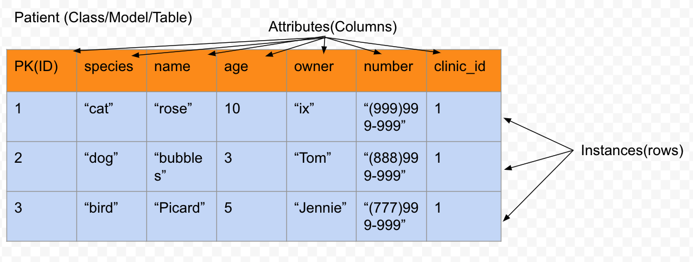
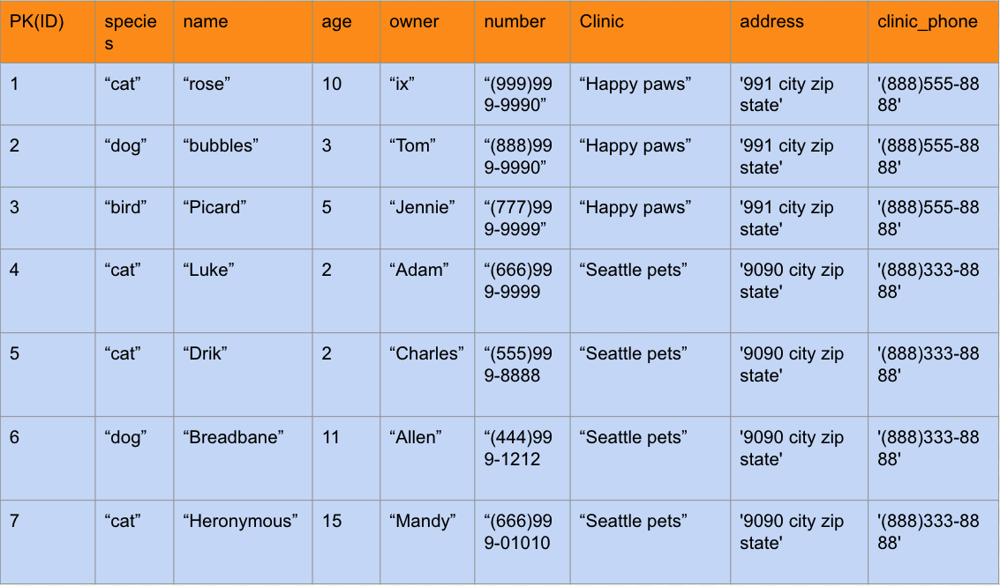

# Intro To Databases
## SWBAT
- [ ] Understand the benefits 
- [ ] Understand the Relationship between a database and API
- [ ] Implement a domain model
- [ ] Implement Mapping columns and rows to classes and instances 
- [ ] Implement Basic SQL queries
- [ ] Implement Primary keys
- [ ] Understand Foreign keys 

## The Project 
The Veterinary clinic that hired us has grown and has a bigger and has the budget to put towards their patent data management. Happy with the CLI we built for them, they will like us to create a database and API with GUI that's easy for their vets and vet techs to use. 
- React Front end (week 3)
- Database (SQL)
- ORM (ruby/active record/sinatra(week-3))
>Note: Database vs API
- Database holds data
- API is the interface that is the communicates between the server and client

## SQL (Structured Query Language)
- A language used to communicate with Databases 
- It allows us to create tables, insert data, update data, delete data, create simple and complex queries for data. 



- Relationships through foreign key can help us avoid duplicate date.
- If one of our clinics needed to update data in the table bellow, we would have to find every row that contains the clinic and update the data in that row. How can we re-organize our data, so we'd only have to update our clinic data once?


 <details>
      <summary>
        solution 
      </summary>
      <hr/>
        
      <hr/>
     </details>
<br/>


```

CREATE TABLE clinic(
    id INTEGER,
    name VARCHAR(30),
    address VARCHAR(50),
    phone VARCHAR(10),
    PRIMARY KEY(id)
);

CREATE TABLE patient(
    id INTEGER,
    clinic_id INTEGER,
    species VARCHAR(30),
    name VARCHAR(50),
    age INTEGER,
    owner VARCHAR(50),
    number VARCHAR(15),
    PRIMARY KEY(id)
    FOREIGN KEY (clinic_id) REFERENCES clinic(id)
);


/* Add data */
INSERT INTO clinic (name, address, phone) VALUES ('Happy pets', '999 city zip state','(888)888-8888' );

INSERT INTO clinic (name, address, phone) VALUES ('Seattle pets clinic','999 city zip state','(888)888-8888' );

INSERT INTO patient (clinic_id, species, name, age, owner, number) VALUES (1, 'cat', 'rose', 10, 'ix', '(999)999-9999');
INSERT INTO patient (clinic_id, species, name, age, owner, number) VALUES (2, 'dog', 'bubbles', 2, 'Tom', '(999)999-9999');
INSERT INTO patient (clinic_id, species, name, age, owner, number) VALUES (1, 'bird', 'picard', 2, 'jennie', '(999)999-9999');

/* Query data */

SELECT * FROM patient


SELECT * FROM patient 
WHERE name='rose'

SELECT * FROM patient 
WHERE age<3

/* Update data */

UPDATE patient
SET  age = 11
WHERE id = 1;

/* Delete data */

DELETE FROM patient
WHERE name='bubbles'


/* relational query */

SELECT patient.name, clinic.name AS clinic_name
FROM patient
INNER JOIN clinic ON patient.clinic_id = clinic.id;

```

## ORM (Object Relational Mapping)
- Uses object oriented programming with database
- Combines SQL and Ruby
- Maps classes and instances to tables
- ORM's solve repetition and organization problems
> Note: CAUTION: Do no mix the two up. While we mimick our Ruby objects as records in the database, they are not the same thing. Ruby object != database record

```
# Mass Assignment 
    def initialize(attributes) 
        attributes.each do |key, value| 
            if self.respond_to?("#{key.to_s}=") 
                self.send("#{key.to_s}=", value) 
            end 
        end
    end

# Create database 
    def self.create_table 
        sql = <<-SQL
        CREATE TABLE IF NOT EXISTS patients (
            id INTEGER,
            clinic_id INTEGER,
            species VARCHAR(30),
            name VARCHAR(50),
            age INTEGER,
            owner VARCHAR(50),
            number VARCHAR(15),
            PRIMARY KEY(id)
        );
        SQL
        DB.execute(sql)
    end 

# Add data

    def save
         sql = <<-SQL
         INSERT INTO patient (species, name, age, owner, number) VALUES (?,?,?,?,?);        
         SQL

        DB.execute(sql, self.species, self.name, self.age, self.owner, self.number)
        @id = DB.last_insert_row_id
        self 
    end

# Query data

    def self.all 
        resources = DB.execute("SELECT * FROM patients")
        resources.map do |hash|
          self.new(hash)
        end
    end


```
